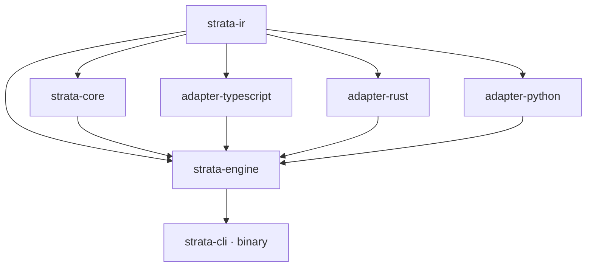
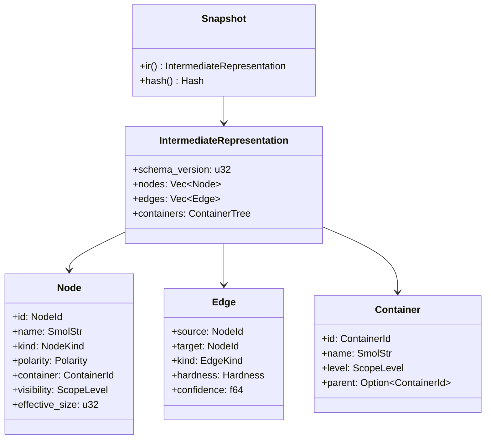

# strata — Architecture

`strata` is a read-only static-analysis tool that proposes a hierarchical, acyclic module decomposition for a codebase. Architecturally it is a two-stage pipeline: language-specific **adapters** turn source files into a single language-agnostic **IR snapshot**, and a pure, deterministic **engine** runs an eleven-phase decomposition over that snapshot. The engine never reads source code — the snapshot is the only contract it understands — which is what lets the same core reason identically about TypeScript, Rust, and Python.

## Crate layout

The workspace is seven crates layered strictly by dependency: the IR sits at the bottom, the pure algorithms depend only on it, the adapters and engine sit above, and the CLI is a thin shell on top.

```text
crates
├── ir                    # the IR snapshot contract — shared vocabulary, no logic
├── core                  # pure decomposition algorithms over the IR
├── adapter-typescript    # TypeScript/TSX → IR fragment (swc)
├── adapter-rust          # Rust → IR fragment (syn + rust-analyzer)
├── adapter-python        # Python → IR fragment (rustpython-parser)
├── engine                # orchestration: discover, parse, assemble, analyze
└── cli                   # the `strata` binary: flags, dispatch, rendering
```



Every crate depends *down*, never sideways or up: adapters and `core` share no dependency, and the engine is the only crate that knows both. The CLI depends only on the engine and re-exposes the same public functions an embedder would call.

## The IR snapshot contract

The `strata-ir` crate defines the single data structure that flows between adapters and the engine. A `Snapshot` (`crates/ir/src/snapshot.rs`) is a validated, content-addressed, immutable view over an `IntermediateRepresentation` — a set of nodes, edges, and a container tree — fingerprinted with a `blake3` hash over its canonical JSON form. Assembly rejects dangling edges, an unknown schema version, and an invalid container tree, so any snapshot the engine receives is already well-formed.



The vocabulary is deliberately small and explicit:

- **Node** (`crates/ir/src/node.rs`): a symbol or type, tagged with a three-valued `Polarity` (`Production`, `TestCase`, `TestSupport`), the container it lives in, a derived `visibility` scope, and its production SLOC. `ScopeLevel` orders the container hierarchy: `File < Folder < Domain < Package < PackageGroup`.
- **Edge** (`crates/ir/src/edge.rs`): a directed dependency with a `kind` (`ValueImport`, `TypeReference`, `Inheritance`, `Call`, `ReExport`), a `Hardness` (`Hard` edges constrain acyclicity; `Soft` edges only affect scoring), and a `confidence` for dynamically-resolved references.
- **Container** (`crates/ir/src/container.rs`): a node in the `ContainerTree`, validated to have dense unique ids, resolvable parents, and strictly ascending levels (a forest).

Adapters never build a `Snapshot` directly. They implement the two-phase `Adapter` trait (`crates/ir/src/adapter.rs`):

```rust
fn parse(&self, files: &[SourceFile]) -> Result<Vec<ParseTree>, AdapterError>;
fn bind(&self, trees: Vec<ParseTree>) -> Result<IrFragment, AdapterError>;
```

`parse` produces opaque adapter-defined trees; `bind` resolves references and emits an `IrFragment` (nodes, edges, containers). The engine merges fragments from all enabled languages, normalizes them, and assembles the one validated snapshot that feeds the analysis pass.

## The decomposition pipeline

`strata-engine`'s `analyze` (`crates/engine/src/analyze.rs`) is a pure function: identical snapshot + config + seed yields an identical result, with no I/O. Spanning the engine and `strata-core`, the work runs as eleven phases.


| # | Phase | Responsibility | Source |
|---|-------|----------------|--------|
| 1 | Extract | Discover sources, run each language adapter, merge the IR fragments | `crates/engine/src/snapshot.rs` |
| 2 | Normalize | Flatten re-export chains to their definitions under a depth guard | `crates/engine/src/snapshot.rs` |
| 3 | Condense | Iterative Tarjan SCC condensation into a quotient DAG | `crates/core/src/condense.rs` |
| 4 | Shatter | Minimum feedback arc set per SCC — exact ILP or heuristic fallback | `crates/core/src/shatter.rs` |
| 5 | Layer | Longest-path layering over the condensation DAG | `crates/core/src/layer.rs` |
| 6 | Cluster | Multilevel acyclic clustering (coarsen → seed → refine) | `crates/core/src/cluster.rs` |
| 7 | Pack | Capacitated packing of atoms into files within the SLOC cap | `crates/core/src/pack.rs` |
| 8 | Derive Visibility | Set each symbol's export scope to the LCA of its consumers | `crates/core/src/visibility.rs` |
| 9 | Project Tests | Specs follow their subjects; enforce production↛test polarity | `crates/core/src/project.rs` |
| 10 | Score | Evaluate the objective J(T) with a per-term breakdown | `crates/core/src/score.rs` |
| 11 | Diversify & Report | Multi-start variation-of-information selection, then render | `crates/core/src/diversify.rs`, `crates/cli/src/render.rs` |

The candidate-generation hot loop in `analyze` runs the restructuring subset — Condense → Layer → Cluster → Score → Diversify — once per profile seed. Shatter, Pack, Derive Visibility, and Project Tests live in `strata-core` and feed cycle-break suggestions, conditional file splits, and the structural violations surfaced by the `violations`, `tree`, and `diff` commands.

The pipeline honors a fixed constraint priority — **acyclicity > test polarity > capacity > cohesion > anchoring**. The first three are hard vetoes during clustering and refinement, never penalty terms; only cohesion and anchoring are scored. Cycle-breaking uses an exact ILP via the bundled [HiGHS](https://highs.dev/) solver for small strongly-connected components (configurable `ilp-threshold`, default 300 nodes) with lazy cycle constraints, falling back to the Eades–Lin–Smyth heuristic above the threshold or on timeout; every break set records whether it was solved exactly.

## Anchored and greenfield parameter profiles

There is no profile-specific algorithm. Anchored and greenfield are complete parameter profiles (`crates/engine/src/config.rs`) executed over the same discovered snapshot. Each owns its candidate count, seed, capacities, objective coefficients, dependency and same-file weights, solver budget, diversification policy, and test policy. Adapter discovery and the process-wide `jobs` hint remain global.

Both profiles evaluate the same objective form:

```text
J(T) = Σ w(e)·c(e)·h(lca) + λ·imbalance − α·naming − β·path + μ·d(T, T0)
```

- **Anchored defaults** keep every term active. The move-distance penalty `μ·d(T, T0)` and path-cohesion bonus `β·path` reward staying close to today's layout.
- **Greenfield defaults** set `μ` and `β` to zero. Explicit nonzero values are valid, so greenfield remains independently configurable instead of forcibly disabling either term.

The CLI's `--mode` flag is a compatibility selector for which parameter profiles execute. It does not supply or alter their policy. Generic `--candidates` and `--seed` overrides apply to every selected profile.

Dependency edges are classified once from immutable analysis-start placement. An edge whose endpoints begin in different files keeps its ordinary dependency-kind price. A same-file edge touching a type uses the profile's `same-file-type` multiplier; every other same-file edge uses `same-file-symbol`. The defaults are `3.0` and `1.0`, respectively, so a type's primary same-file consumer has stronger affinity than weaker external type references without changing runtime-symbol affinity.

## Analysis result contract

Result schema version 4 separates facts shared by the executed profiles from profile-specific evaluation:

```text
AnalyzeResult
├── schemaVersion, snapshotHash, summary
├── current
│   ├── tree
│   └── sharedFindings
└── profiles
    ├── anchored
    │   ├── parameters
    │   ├── current
    │   │   ├── score, scoreBreakdown, standing, capacityBreaks
    │   │   └── uniqueFindings
    │   └── candidates, pairwiseDistance, solutionSpaceConverged
    └── greenfield
        └── same shape
```

A finding is shared only when its complete serialized content is identical in both executed profiles. Each profile's `uniqueFindings` excludes that exact intersection. A single-profile run leaves `sharedFindings` empty, while deterministic sorting and deduplication keep JSON and human output stable. Profile gains are compared only with that profile's current score.

Capacity findings are profile-dependent because caps belong to profiles. A physical folder measures direct files plus immediate child folders; descendants below those children do not inflate it. Measures at or below the cap produce no finding, values above the cap through 110% are `Borderline`, and larger values are `Violation`.

Cycle findings resolve every member to repository-relative paths and explain the placement consequence: the members form one placement unit and must remain in one file unless the suggested dependency edge is broken. The cheapest cut and its exact-or-heuristic method remain profile-specific when dependency weights change its serialized content.

## Main components

- **`Snapshot` / `IntermediateRepresentation`** (`crates/ir/src/snapshot.rs`): the validated, content-addressed contract between adapters and the engine — the single source of truth the analysis runs on.
- **`Adapter` trait** (`crates/ir/src/adapter.rs`): the two-phase `parse`/`bind` interface every language adapter implements, isolating all language knowledge from the engine.
- **`analyze`** (`crates/engine/src/analyze.rs`): the pure entry point that drives the pipeline per parameter profile and seed and returns an `AnalyzeResult`.
- **`snapshot_from_root`** (`crates/engine/src/snapshot.rs`): source discovery, adapter dispatch by file extension, fragment merging, and re-export normalization.
- **`AnalyzeConfig` / `load_config`** (`crates/engine/src/config.rs`): the `strata.toml` schema and validation, mapping config sections to objective weights, capacities, and solver budgets.
- **`StrataError`** (`crates/engine/src/error.rs`): the typed error surface with stable remedy codes that the CLI maps to exit code `1`.
- **Decomposition algorithms** (`crates/core/src`): `condense`, `shatter`, `layer`, `cluster`, `pack`, `visibility`, `project`, `score`, and `diversify` — each a pure phase over the IR.
- **CLI dispatch and rendering** (`crates/cli/src/main.rs`, `crates/cli/src/render.rs`): clap-derived flag parsing, subcommand dispatch, the TTY-aware summary/JSON face, and the fixed exit-code mapping (`0`/`1`/`2`).
- **Language adapters** (`crates/adapter-typescript`, `crates/adapter-rust`, `crates/adapter-python`): swc-, syn+rust-analyzer-, and rustpython-based front ends, each pairing a `parse` module with a `bind` reference resolver and an `sloc` size counter.
