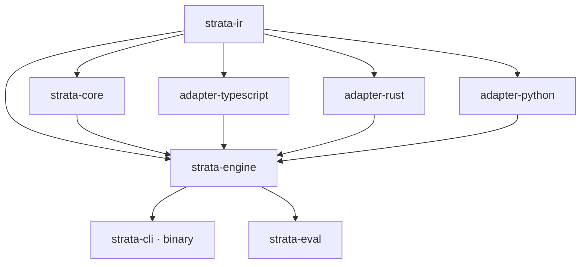
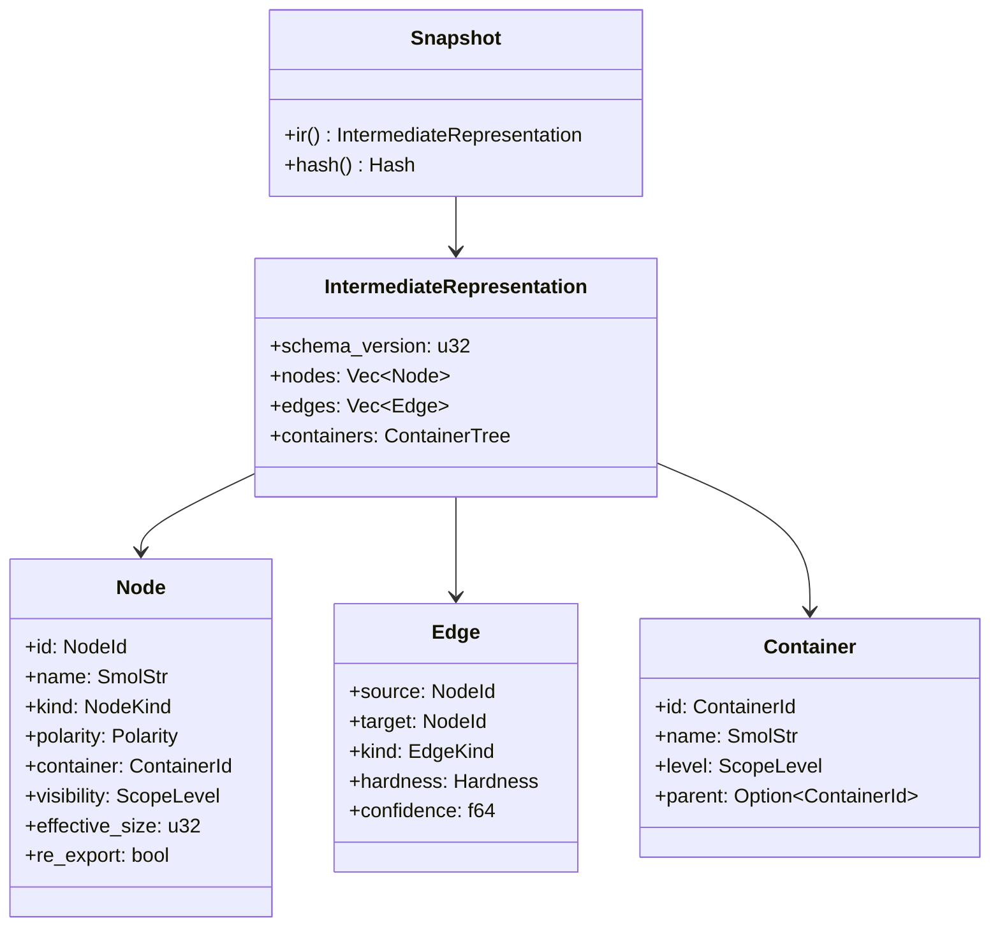

# strata — Architecture

`strata` is a read-only static-analysis tool that proposes a hierarchical, acyclic module decomposition for a codebase. Architecturally it is a two-stage pipeline: language-specific **adapters** turn source files into a single language-agnostic **IR snapshot**, and a pure, deterministic **engine** runs an eleven-phase decomposition followed by evidence qualification and cross-profile advice aggregation. The engine never reads source code — the snapshot is the only contract it understands — which is what lets the same core reason identically about TypeScript, Rust, and Python.

## Crate layout

The workspace is eight crates layered strictly by dependency: the IR sits at the bottom, the pure algorithms depend only on it, the adapters and engine sit above, and the CLI and the evaluation harness are thin consumers of the engine on top.

```text
crates
├── ir                    # the IR snapshot contract — shared vocabulary, no logic
├── core                  # pure decomposition algorithms over the IR
├── adapter-typescript    # TypeScript/TSX → IR fragment (swc)
├── adapter-rust          # Rust → IR fragment (syn + rust-analyzer)
├── adapter-python        # Python → IR fragment (rustpython-parser)
├── engine                # orchestration: discover, parse, assemble, analyze
├── eval                  # constraint-target evaluation harness over the engine
└── cli                   # the `strata` binary: flags, dispatch, rendering
```



Every crate depends *down*, never sideways or up: adapters and `core` share no dependency, and the engine is the only crate that knows both. The CLI depends only on the engine and re-exposes the same public functions an embedder would call; the evaluation harness likewise drives the engine in-process as a library.

## The IR snapshot contract

The `strata-ir` crate defines the single data structure that flows between adapters and the engine. A `Snapshot` (`crates/ir/src/snapshot.rs`) is a validated, content-addressed, immutable view over an `IntermediateRepresentation` — a set of nodes, edges, and a container tree — fingerprinted with a `blake3` hash over its canonical JSON form. Assembly rejects dangling edges, an unsupported schema version, and an invalid container tree, so any snapshot the engine receives is already well-formed. The IR is at schema version 3; assembly still reads version 2 and upgrades it by deriving `Node.re_export` from its re-export edges ([ADR-0020](decisions/0020-re-exports-and-associated-calls-in-visibility.md)).



The vocabulary is deliberately small and explicit:

- **Node** (`crates/ir/src/node.rs`): a symbol or type, tagged with a three-valued `Polarity` (`Production`, `TestCase`, `TestSupport`), the container it lives in, a derived `visibility` scope, and its production SLOC. `ScopeLevel` orders the container hierarchy: `File < Folder < Domain < Package < PackageGroup`.
- **Edge** (`crates/ir/src/edge.rs`): a directed dependency with a `kind` (`ValueImport`, `TypeReference`, `Inheritance`, `Call`, `ReExport`), a `Hardness` (`Hard` edges constrain acyclicity; `Soft` edges only affect scoring), and a `confidence` for dynamically-resolved references.
- **Container** (`crates/ir/src/container.rs`): a node in the `ContainerTree`, validated to have dense unique ids, resolvable parents, and strictly ascending levels (a forest).

Adapters never build a `Snapshot` directly. They implement the two-phase `Adapter` trait (`crates/ir/src/adapter.rs`):

```rust
fn parse(&self, files: &[SourceFile]) -> Result<Vec<ParseTree>, AdapterError>;
fn bind(&self, trees: Vec<ParseTree>) -> Result<IrFragment, AdapterError>;
```

`parse` produces opaque adapter-defined trees; `bind` resolves references and emits an `IrFragment` (nodes, edges, containers). The engine merges fragments from all enabled languages, normalizes them, and assembles the one validated snapshot that feeds the analysis pass.

## The decomposition pipeline

`strata-engine`'s `analyze` (`crates/engine/src/analyze.rs`) is a pure function: identical snapshot + config + seed yields an identical result, with no I/O. Spanning the engine and `strata-core`, the work runs as eleven phases.

```mermaid
flowchart LR
    extract[Extract] --> normalize[Normalize]
    normalize --> condense[Condense]
    condense --> shatter[Shatter]
    shatter --> layer[Layer]
    layer --> cluster[Cluster]
    cluster --> pack[Pack]
    pack --> visibility[Derive Visibility]
    visibility --> project[Project Tests]
    project --> score[Score]
    score --> diversify[Diversify]
    diversify --> report[Report]
```



| # | Phase | Responsibility | Source |
|---|-------|----------------|--------|
| 1 | Extract | Discover sources, run each language adapter, merge the IR fragments | `crates/engine/src/snapshot.rs` |
| 2 | Normalize | Flatten re-export chains to their definitions under a depth guard | `crates/engine/src/snapshot.rs` |
| 3 | Condense | Iterative Tarjan SCC condensation into a quotient DAG | `crates/core/src/condense.rs` |
| 4 | Shatter | Minimum feedback arc set per SCC — exact ILP or heuristic fallback | `crates/core/src/shatter.rs` |
| 5 | Layer | Longest-path layering over the condensation DAG | `crates/core/src/layer.rs` |
| 6 | Cluster | Multilevel acyclic clustering (coarsen → seed → refine) | `crates/core/src/cluster.rs` |
| 7 | Pack | Capacitated packing of atoms into files within the SLOC cap | `crates/core/src/pack.rs` |
| 8 | Derive Visibility | Set each symbol's export scope to the LCA of its consumers | `crates/core/src/visibility.rs` |
| 9 | Project Tests | Specs follow their subjects; enforce production↛test polarity | `crates/core/src/project.rs` |
| 10 | Score | Evaluate the objective J(T) with a per-term breakdown | `crates/core/src/score.rs` |
| 11 | Diversify & Report | Multi-start variation-of-information selection, then render | `crates/core/src/diversify.rs`, `crates/cli/src/render.rs` |

The candidate-generation hot loop in `analyze` runs the restructuring subset — Condense → Layer → Cluster → Score → Diversify — once per profile seed. Shatter, Pack, Derive Visibility, and Project Tests live in `strata-core` and feed cycle-break suggestions, conditional file splits, and the structural violations surfaced by the `violations`, `tree`, and `diff` commands.

The pipeline honors a fixed constraint priority — **acyclicity > test polarity > capacity > cohesion > anchoring**. The first three are hard vetoes during clustering and refinement, never penalty terms; only cohesion and anchoring are scored. Cycle-breaking uses an exact ILP via the bundled [HiGHS](https://highs.dev/) solver for small strongly-connected components (configurable `ilp-threshold`, default 300 nodes) with lazy cycle constraints, falling back to the Eades–Lin–Smyth heuristic above the threshold or on timeout; every break set records whether it was solved exactly.

## Anchored and greenfield parameter profiles

There is no profile-specific algorithm. Anchored and greenfield are complete parameter profiles (`crates/engine/src/config.rs`) executed over the same discovered snapshot. Each owns its candidate count, seed, capacities, objective coefficients, evidence-qualification thresholds and weights, dependency and same-file weights, solver budget, diversification policy, and test policy. Adapter discovery and the process-wide `jobs` hint remain global.

Both profiles evaluate the same objective form:

```text
J(T) = cut + λ·imbalance − α·naming − β·path
     + μ·d(T, T0) + γ·capacity + δ·dependency-only
     + ε·companion-separation
```

- **Anchored defaults** keep every term active. The move-distance penalty `μ·d(T, T0)` and path-cohesion bonus `β·path` reward staying close to today's layout.
- **Greenfield defaults** set `μ` and `β` to zero. Explicit nonzero values are valid, so greenfield remains independently configurable instead of forcibly disabling either term.

The CLI's `--mode` flag is a compatibility selector for which parameter profiles execute. It does not supply or alter their policy. Generic `--candidates` and `--seed` overrides apply to every selected profile.

Dependency edges are classified once from immutable analysis-start placement. An edge whose endpoints begin in different files keeps its ordinary dependency-kind price. A same-file edge touching a type uses the profile's `same-file-type` multiplier; every other same-file edge uses `same-file-symbol`. The defaults are `3.0` and `1.0`, respectively, so a type's primary same-file consumer has stronger affinity than weaker external type references without changing runtime-symbol affinity.

The `dependency-only` term charges a fixed profile coefficient, defaulting to `0.05`, once for each relocated production declaration whose destination contained at analysis start at least one target of the declaration's outgoing structural dependencies and no incoming consumer. All structural IR edge kinds participate, self-loops are ignored, and the current layout has zero dependency-only pressure. Setting the coefficient to `0.0` disables the charge. Tentative admission, candidate ordering, total scores, score breakdowns, gains, and narrated move deltas all use this same pass-start classification.

Adapters may emit language-neutral companion-owner affinities separately from dependency edges. TypeScript emits one only for a signature type with an approved role suffix whose semantic name tokens uniquely match a function or class method. The `companion-separation` term, defaulting to `0.05`, charges a companion unless it occupies its owner's immutable analysis-start file. Moving the owner toward the type earns no benefit, and affinities never enter cuts, cycles, reach, capacity, polarity, or dependency guards.

Symbol admission separately protects shared ownership. Incoming consumers are resolved to their analysis-start physical folders. If consumers span multiple child-folder branches beneath their lowest common ancestor, a declaration cannot move into only one of those branches, even when unrelated pass-start dependencies already connect the folders. Moves remain eligible when there is one consumer, all consumers occupy one folder, or the destination is a neutral shared branch or the consumers' common ancestor.

## Evidence-qualified profile consensus

Candidate search and scoring remain profile-local. After each executed profile has constructed and ranked its candidates, the engine atomizes the first candidate into individual file and symbol proposals. An immutable `EvidenceIndex` built from the analysis-start snapshot evaluates each selected destination using six weighted signals: unique owner, role affinity, source cohesion, destination cohesion, producer evidence, and architectural reach. The evidence score uses all six signals; a separate structural score excludes role affinity so a name match cannot satisfy the structural gate. The ambiguity margin compares the selected destination with the strongest conservative pass-start alternative.

Alternative destinations are drawn from the current source, incident production-neighbor homes, explicit owner homes, and the consumers' common physical folder. This set intentionally over-approximates plausible alternatives instead of reconstructing all optimizer admission checks. Consequently, an alternative that would not survive search may lower the margin and demote advice to review, but the qualification stage cannot promote a move or remove it from the raw profile candidate.

Qualification thresholds and evidence weights belong to the parameter profile. The defaults are `minimum-evidence = 0.60`, `minimum-structural = 0.50`, and `minimum-ambiguity-margin = 0.15`, with weights `0.10`, `0.10`, `0.25`, `0.25`, `0.10`, and `0.20` in the signal order above. These are soft confidence parameters. Namespace, reach, file-role, dependency-envelope, and relocation-policy guards remain shared structural constraints and run before qualification.

Cross-profile aggregation gives each executed profile at most one vote per relocation identity from its first candidate. A destination becomes `Recommended` only when the selecting profiles qualify it and those qualified votes form a strict majority of every executed profile. Two profiles therefore require agreement from both. Safe proposals with weak evidence, a weak structural score, an insufficient ambiguity margin, partial support, or conflicting destinations remain `Review candidate` advice. A single-profile run may recommend a move only after its evidence gates pass. Ordinary non-moves are absent; the result has no rejected group.

## Analysis result contract

Result schema version 9 records each profile's `allow-cross-package-moves` relocation parameter (ADR-0017); version 8 introduced the layout below. The result separates facts shared by the executed profiles from profile-specific evaluation, records both relocation-policy objective terms, links exact test followers to their primary file move, and adds evidence-qualified advice:

```text
AnalyzeResult
├── schemaVersion, snapshotHash, summary
├── current
│   ├── tree
│   └── sharedFindings
├── advice
│   ├── recommended
│   └── reviewCandidates
└── profiles
    ├── anchored
    │   ├── parameters
    │   ├── current
    │   │   ├── score, scoreBreakdown, standing, capacityBreaks
    │   │   └── uniqueFindings
    │   └── candidates, pairwiseDistance, solutionSpaceConverged
    └── greenfield
        └── same shape
```

Each primary file `Move` carries `mirrors` and `blockedMirrors`. A successful mirror records its triggering `sourcePath`, test `path`, `from`, and `to`; a blocked best-effort follower records `sourcePath`, `path`, `from`, `intendedTo`, and a deterministic `reason`. Successful followers participate in the candidate layout and its score exactly once but remain part of the primary recommendation rather than becoming standalone moves.

Each profile's score breakdown serializes the additional terms as `dependencyOnly` and `companionSeparation`. Configuration and human output use `dependency-only` and `companion-separation`. Readers reject earlier result schema versions instead of inferring missing score components.

Each advice item retains the underlying file or symbol relocation and records its destination, supporting and qualifying profiles, absent profiles, conflicting destinations, per-profile assessments, and deterministic review reasons. An assessment exposes the six raw evidence signals, normalized evidence and structural scores, ambiguity margin and best alternative, effective thresholds, and qualification result. Raw profile candidates remain present so advice classification does not replace the optimizer's detailed output.

A finding is shared only when its complete serialized content is identical in both executed profiles. Each profile's `uniqueFindings` excludes that exact intersection. A single-profile run leaves `sharedFindings` empty, while deterministic sorting and deduplication keep JSON and human output stable. Profile gains are compared only with that profile's current score.

Capacity findings are profile-dependent because caps belong to profiles. A physical folder measures direct files plus immediate child folders; descendants below those children do not inflate it. Measures at or below the cap produce no finding, values above the cap through 110% are `Borderline`, and larger values are `Violation`.

Cycle findings report only components spanning distinct source-file identities; intra-file recursion is not a violation. The optimizer still keeps mutually recursive symbols in one placement unit. Reported cycles resolve every member to repository-relative paths and explain the placement consequence: the members form one placement unit and must remain in one file unless the suggested dependency edge is broken. The cheapest cut and its exact-or-heuristic method remain profile-specific when dependency weights change its serialized content.

## Main components

- **`Snapshot` / `IntermediateRepresentation`** (`crates/ir/src/snapshot.rs`): the validated, content-addressed contract between adapters and the engine — the single source of truth the analysis runs on.
- **`Adapter` trait** (`crates/ir/src/adapter.rs`): the two-phase `parse`/`bind` interface every language adapter implements, isolating all language knowledge from the engine.
- **`analyze`** (`crates/engine/src/analyze.rs`): the pure entry point that drives the pipeline per parameter profile and seed and returns an `AnalyzeResult`.
- **`EvidenceIndex` and advice aggregation** (`crates/engine/src/analyze/advice.rs`): immutable pass-start evidence qualification followed by deterministic cross-profile grouping into recommended and review-candidate advice.
- **`snapshot_from_root`** (`crates/engine/src/snapshot.rs`): source discovery, adapter dispatch by file extension, fragment merging, and re-export normalization.
- **`AnalyzeConfig` / `load_config`** (`crates/engine/src/config.rs`): the `strata.toml` schema and validation, mapping config sections to objective weights, capacities, and solver budgets.
- **`StrataError`** (`crates/engine/src/error.rs`): the typed error surface with stable remedy codes that the CLI maps to exit code `1`.
- **Decomposition algorithms** (`crates/core/src`): `condense`, `shatter`, `layer`, `cluster`, `pack`, `visibility`, `project`, `score`, and `diversify` — each a pure phase over the IR.
- **CLI dispatch and rendering** (`crates/cli/src/main.rs`, `crates/cli/src/render.rs`): clap-derived flag parsing, subcommand dispatch, the plain-text default with explicit JSON selection, and the fixed exit-code mapping (`0`/`1`/`2`). Terminal and Markdown reports consume one private report representation assembled from the saved result. Candidate change trees compare saved file identities and recorded moves to show physical before/after paths; virtual grouping labels are not treated as directories. Wrapped change-tree labels retain branch ancestry and literal path characters, preferring word or path boundaries within 100 display columns. Presentation options control numerical detail without changing the analysis payload.
- **Language adapters** (`crates/adapter-typescript`, `crates/adapter-rust`, `crates/adapter-python`): swc-, syn+rust-analyzer-, and rustpython-based front ends, each pairing a `parse` module with a `bind` reference resolver and an `sloc` size counter.
